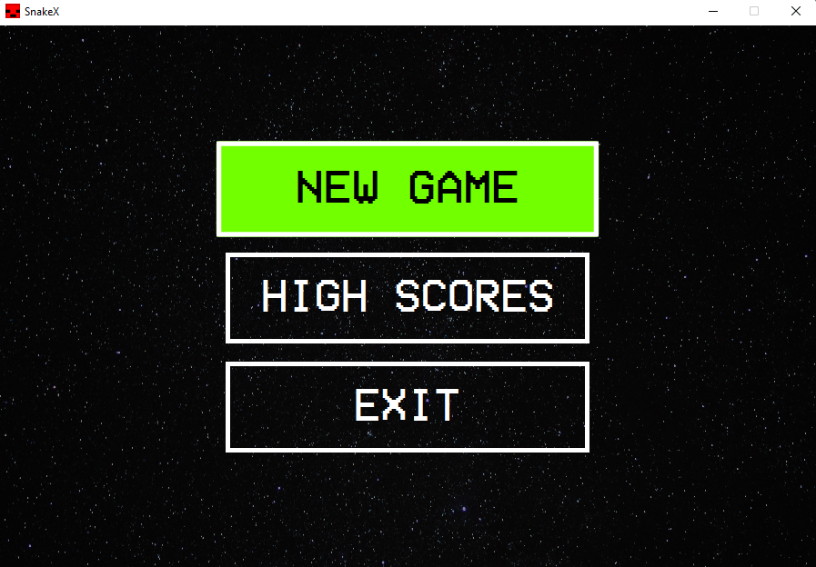
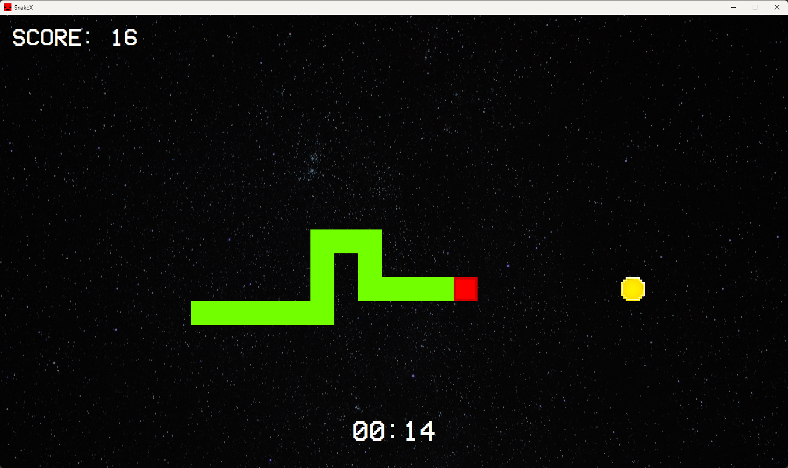
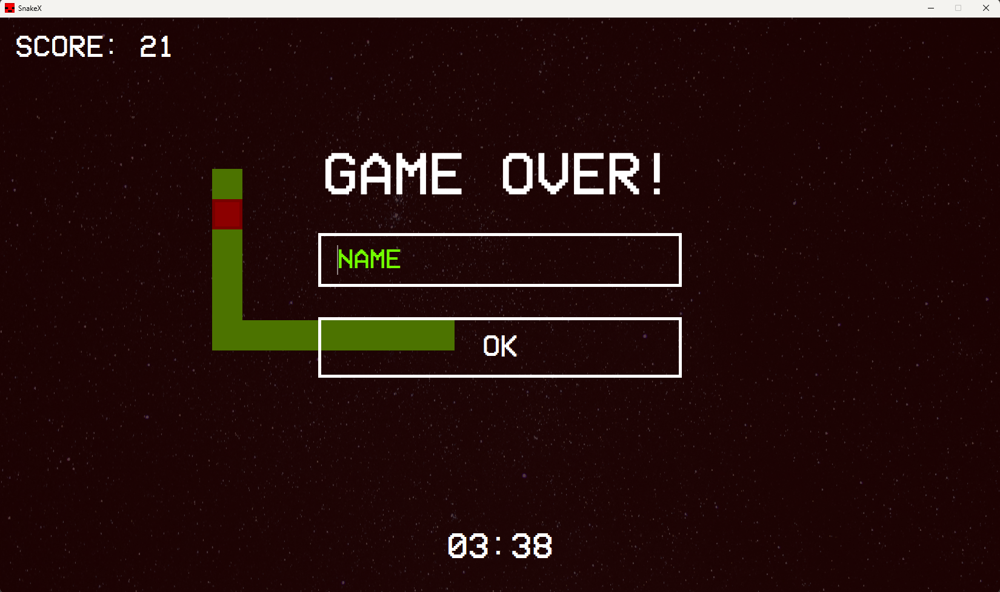

# Snake - the game written using Java

## Features:
- Movement using WASD
- Randomly spawning coins: yellow or special
- Coin effects:
    - Yellow Coin → Snake grows + Score increases
    - Special Coin → Only Score increases
- Built-in timer
- Highscore system

## Prerequisites
1. **Java Development Kit (JDK)**:
  - Ensure you have JDK 17 installed.
  - Verify installation by running:
    ```bash
    java -version
    ```
2. **Maven**:
  - Install Maven for dependency management and building the project.
  - Verify installation by running:
    ```bash
    mvn -version
    ```

## Run the Application
```bash
mvn javafx:run
```
###




